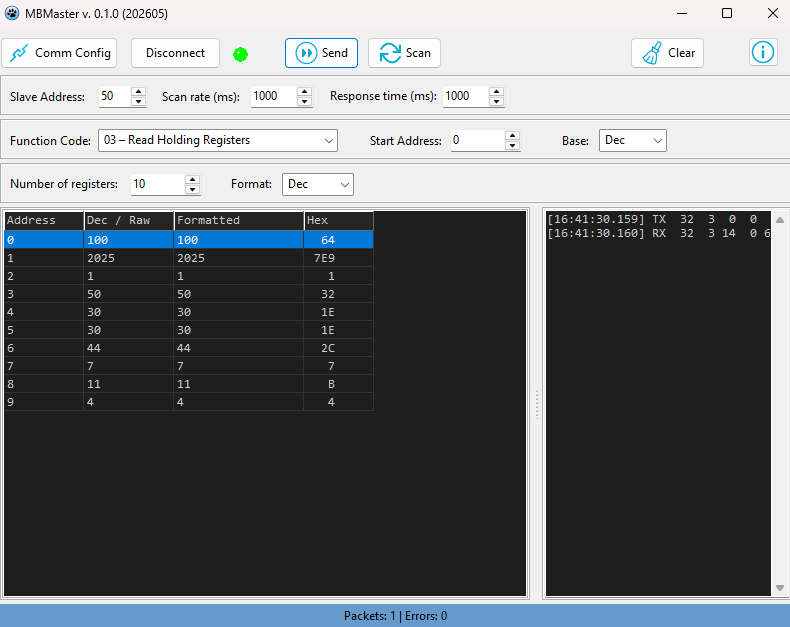

# Modbus RTU Master

**DISCLAIMER: Documentation, including this readme, generated using Antropic's Claude Opus 4.7**

A lightweight, single-window **Modbus RTU Master** for serial devices, written in **Free Pascal / Lazarus (LCL)**. It reads and writes coils, discrete inputs, holding registers, and input registers over an RS‑232/RS‑485 serial link, with a built-in protocol bus monitor.


## Features

- **All common function codes**
  - `01` Read Coils
  - `02` Read Discrete Inputs
  - `03` Read Holding Registers
  - `04` Read Input Registers
  - `05` Write Single Coil
  - `06` Write Single Register
  - `15` Write Multiple Coils
  - `16` Write Multiple Registers
- **Two execution modes for every function code**
  - **Send** — one-shot execution
  - **Scan** — continuous polling at a configurable interval
- **Flexible data display** — Decimal, Hex, Binary, 32-bit Float, 32-bit Int
- **Editable write grid** — type the values to write directly into the table
- **Built-in bus monitor** — every TX/RX frame shown as a timestamped hex dump
- **Live statistics** — packet and error counters, CRC validation, slave-exception decoding


## Screenshots




## Usage

1. **Comm Config** — select the serial port, baud rate, parity, data/stop bits.
2. **Connect** — opens the port (LED turns green). *Connecting does not start polling.*
3. Set the **slave address**, **function code**, **start address**, and **quantity**.
4. Choose a **display format** (and **endian** for 32-bit values).

### Reading

- **Send** performs one read and fills the grid.
- **Scan** repeats the read every *Scan Rate* milliseconds until pressed again (**Stop**).

### Writing

1. Pick a write function code (`05`, `06`, `15`, `16`). The grid switches to an editable **Value to Write** column.
2. Type the value(s) — for coils use `1` (ON) or `0` (OFF); for registers use decimal.
3. **Send** writes once; **Scan** writes repeatedly.
4. The **Status** column shows ✓ Sent or an error; the slave's echo appears in the bus monitor.

### Bus monitor

Every frame is logged:

```
[14:35:07.042] TX  01 03 00 00 00 0A C5 CD
[14:35:07.061] RX  01 03 14 00 64 00 C8 ...
[14:35:09.310] RX  01 83 02 C0 F1            ← BAD CRC
```

- `TX` = master request, `RX` = slave response
- CRC errors and slave exceptions are annotated inline
- **Clear** empties the monitor; it auto-trims to the last 1000 lines


## License

This project is released under the MIT License. See [`LICENSE`](LICENSE) for details.
